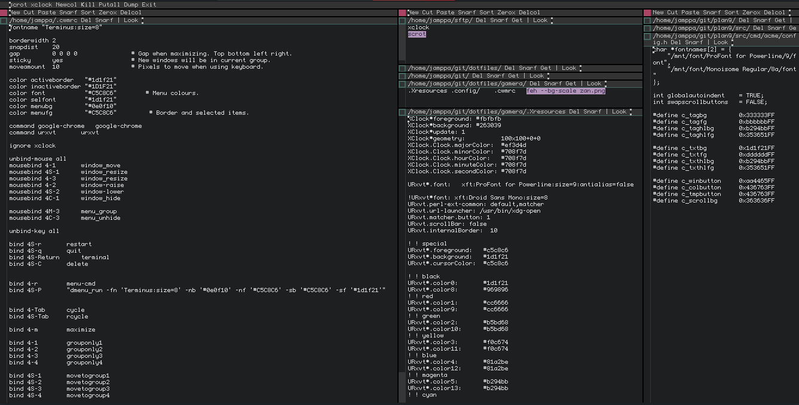
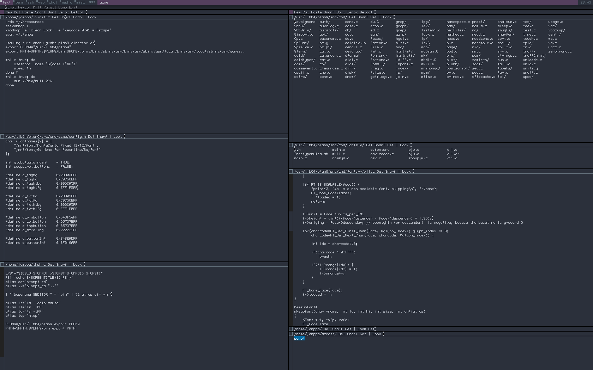
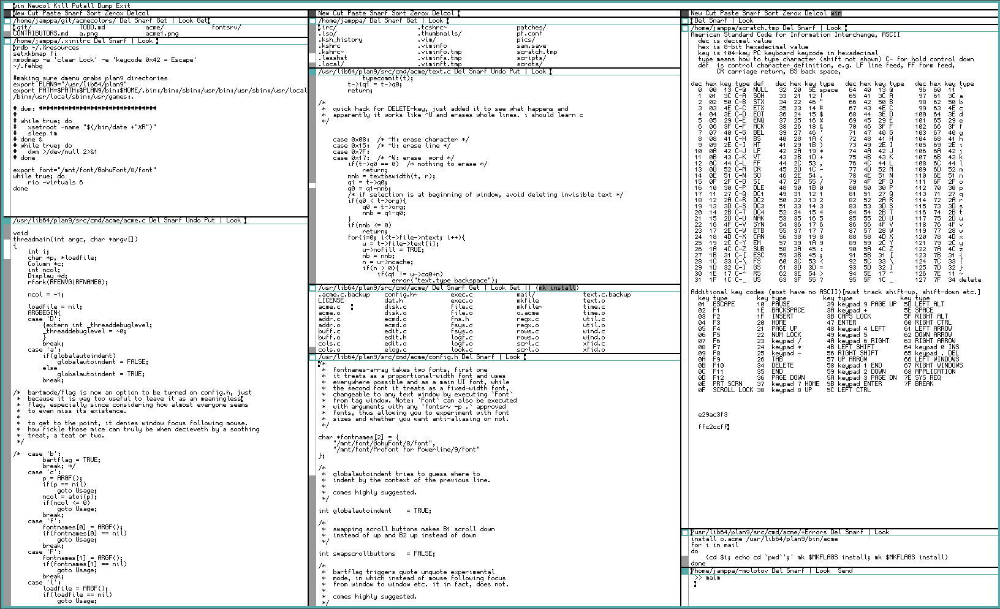

# acme2k

### ACME INTERNATIONAL COMPILED EDITORS

#### THEY EDIT LIKE HELL.
```
   No editor made, pretty much anywhere,

surpasses our Acme in shape, material or finish.
```
solid forged of unsigned int pieces of best wrought C, linked at the binary; tag line is made of one piece of code, compiled with -funroll-loops to the the rest of the window column and warranted with a [permissive license](src/cmd/acme/LICENSE). text window has sufficient refactoring done to insure stability and prevent SEGFAULTing; has ug, but perfectly written shell: [rc](http://doc.cat-v.org/plan_9/4th_edition/papers/rc); acme is linted and debugged by a special compiler so that there are no functions that return structures or integer and floating numbers in object code not converted to known formats and byte orders; [config.h](src/cmd/acme/config.h) should be perfectly tempered by the user or it will fuck up. mkfiles are straight and true, so you will have no trouble on account of acme returning cryptic compiler errors and not compiling.

ready thyself for thine bodieth utmost horrrifiength challengeth and read more about [acme](http://acme.cat-v.org/)

## acme2k features


>*who needs syntax highlighting when this fine piece of work purrs and shows that these fangs got all kinds of shades of visceral strewn around, yet in finite enough of quantities to forbid you from not appreciating its scarcity, elevating it from a mere editor to a sublime Rothko, while emacs sinks in it's kitschy aesthetics, no matter how hard the themes try to salvage that bloated-out-of-proportions Titanic...*

+ a centralized `config.h`-header heavily inspired by suckless school of software design philosophy; allowing customization of software specifically prior to its compilation

  + autoindent, swapscrollbars, fonts and the `acme2k` colorscheme modifiable by the user, or shared by a community of likemined `acme2k`-enthusiasts, allowing for a personalized and/or collaborative  look and feel.
    + 14 elements to define your very own colors for. simply breathtaking. i do say, wow.

  + the so-called bartflag ( = *window focus not following the mouse pointer*) removed as a runtime flag and moved to a configurable option in `config.h`. ive also gone ahead and set it to **TRUE** on default, since mouse accidentally moving and changing the focus from the tag window, it occupying a rather limited area, to the middle of the text and editing the file in question by accident, seemed to be a common complaint online and a general nuisance for me.

+ no zero-sum game between the mouse and the keyboard. balancing the options so you are not doomed to pick up the mouse as soon as you've overstepped the boundaries of keybindings

  + arrow keys navigate through text up one letter and down one letter instead of scrolling seemingly indiscriminate amount of lines, making you take your time finding where you were supposed to be at that very moment.

  + `ctrl+c`, `ctrl+x`, `ctrl+v` for snarfing, cutting and pasting selected text; `ctrl+z` for undo and `ctrl+y` for redo.

  + `home` and `end` move the cursor to the start or to the end of the current line respectively as do the original keybindings `ctrl+a` and `ctrl+e`. (originally intended to remove them, and i still might if i find better uses for those shortcuts.)

  + `delete` deletes all text from the start of the line until cursor position. (a placeholder feature tbh)

+ the end ... ?

# brass tacks (the serious business)
## dependencies
`acme2k` depends on `plan9port` which can be found [here on github](https://github.com/9fans/plan9port) or on your local repository. i know debian has stripped *plan9*-userpace called `9base` but i wouldn't roll the dice with this working with only it as a dependency. don't know; haven't a clue, now's your chance to feel useful and test it out. i mean if you feel like it.

## installation
after following the instructions in your `$PLAN9`-folder to run `./INSTALL` and `mk`'ing every goddamn *plan9*-userspace application there happens to be ported, you can move right on to mangle the tightly-knit web these applications form with this very github project you've atleast been eyein':


>*that low contrast base16-ocean soothes your senses with a subtle balance of peace, quiet and solitude to your zen-like coding session, where it is just you, your workflow and fingertips dancing on the keyboard in a polyrhythmic, primitive thumping fashion. truly gaia has blessed you with this editor.*

next, you should proceed to replace the `plan9port`'s defined `$PLAN9/src/cmd` with the `acme2k`'s `$GITPATH/src/cmd`.

now you can choose whether you want the *highly experimental* patched `fontsrv/x11.c`, which overrides the hardcoded dpi for font rendering etc. or would you rather leave the `fontsrv` untouched by a patch, that at worst can cause stability issues since i haven't had the chance to put it through the same wear and tear as the `plan9port`-devs have to the vanilla version.

So to sum what you could do for example:

```bash
git clone https://github.com/karahobny/acme2k.git; cd acme2k
cp -r src/cmd/acme $PLAN9/src/cmd/acme
cp -r src/cmd/fontsrv $PLAN9/src/cmd/fontsrv # optional if you
# were too busy to skim through the preceeding passage,
# you just might be a goddamn millenial
```

you may need to build from the `INSTALL`-file located in the `$PLAN9`-root, but usually its enough to build from your recently replaced `acme`-folder, obviously not before editing the contents of `config.h` to your likings, it should be commented more than enough to explain what every little variable or **#define** does.

 `$GITPATH/colors` are just some example colorschemes i've made, fiddled with and been juggling between.

```bash
cd $PLAN9/src/cmd/acme; mk install
cd $PLAN9/src/cmd/fontsrv; mk install # optional part for
# if you want the patched fontsrv/x11.c. common sense rly           
```

### config.h
`config.h` includes all the neccesary color and font modifications you just need to `mk install` it after every time you modify it, strongly inspired by suckless design philosophy of software.  feel free to read more about it [here](https://suckless.org/philosophy).

#### fonts
you run `fontsrv -p .` to list all the available fonts from X11 to fontsrv; basically its only limited to your installed TrueType-fonts, so if you wish to use a bitmap font, make sure you specifically have the `.ttf` available; and then use the fonts in a format like this for example:
```bash
"/mnt/font/[listed font]/[font size][a(ntialias)/no a(antialias)]/font"

"/mnt/font/Monaco/9a/font",
"/mnt/font/GohuFont/9/font",
```


>*dont be shackled by dark hues and saturated pinks. make Glenda, the Bunny, proud by showing off the team colors aka the Rio Windowing Systems. "little black-on-white makes a little rob pike smile. when? every now and then!", or so ive been told.*

in this case the first option would stand for Monaco size 9 antialised, the second for GohuFont size 9 aliased, ofc.

insert two fonts into `config.h`'s font-array separating them with a comma. the first one is treated as a proportional width font and is used everywhere in `acme`, and by extension `acme2k`, by default. the second one can be activated for a specific window by executing `Font` from its tag window.

#### colors
colors need to be in the format of `0x*rgb hex color code*FF` without the prefixed hashtag. i'd suggest just to experiment what all the **#defines** mean but to start you with something `C_TAGBG` means tag window background color. `C_TXTBG` means text window backgorund color. `...HLBG/FG` means highlighted text background and foreground color etc. i've taken the liberty to comment all the color variations and what they affect on [config.h's noticeable comment section](src/cmd/acme/config.h).

## but WHAT can I do
definetly check out [TODO](docs/TODO.md) and feel free to chime in what would you like to see as a feature, add an issue or clone the repo and edit [TODO.md](docs/TODO.md) and push it to the upstream, if all you want to do is add feature ideas. for bug fixes and coding features its better to contact me at:
````
karahobny at gmail dot com
````
or branch and send a pull request so i can check it out, dont worry ill always tip and youll get your name on the contributors list and you can for all i care, add your name on a comment preceding the codeblock in question, you know p. much what ever that doesnt harm the readability of the code, im all about you people having the respect you deserve for having partaken in such a sweet project.

## license (or whats the other one ive never heard of)
yeah no one's really heard of that other one, it was just a fucked up situation where *plan9* guys' hands were forced by lawyers to use that for some reason. *plan 9* also got gpl'd for some time but that version is meaningless and a joke afaik; up still here in github if it somehow jollies your gollies.

project is licensed as following (if ive understood correctly and this is allowed), the original unmodified `plan9port` being under [**lucent public license**](docs/LICENSE.LUCENT) which specifically disallows any warranty, like every goddamn license in the whole goddamn universe and allows for me to sublicense it as i see fit so ive seen fit to specifically license my modest modifications under [**mit license**](docs/LICENSE.MIT), simply because it's more straightforward a permissive license and nobody really has to second guess what its trying to allow/disallow a developer and/or consumer to do.

ive yet to have had to think about accepting contributions from other licenses than **lucent** or **mit** since this is still in its faltering baby steps, but id still hope if you would think about trying to avoid having a deck of licenses to show instead of actual features in our repository.
